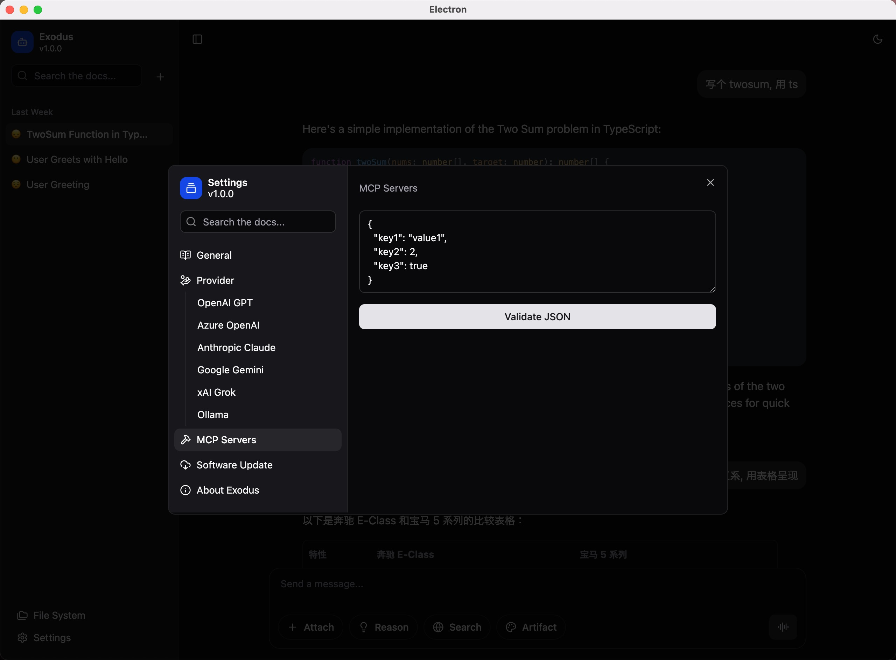

# Exodus

## Introduction

Exodus is a high-performance, cross-platform AI chat application for desktop that is compatible with a variety of model providers.

## Model Providers

> [!NOTE]
> Exodus updates its model provider list as the providers are updated. The following table lists the currently supported chat and reasoning models.

| Provider         | Chat Models                                                                 | Reasoning Models                        |
| ---------------- | --------------------------------------------------------------------------- | --------------------------------------- |
| OpenAI GPT       | gpt-4.1, gpt-4.1-mini, gpt-4.1-nano, gpt-4o, gpt-4o-mini, chatgpt-4o-latest | o4-mini, o3-mini, o3, o1, o1-pro        |
| Azure OpenAI     | gpt-4.1, gpt-4.1-mini, gpt-4.1-nano, gpt-4o, gpt-4o-mini, chatgpt-4o-latest | o4-mini, o3-mini, o3, o1, o1-pro        |
| Google Gemini    | gemini-2.5-flash-preview-05-20                                              | gemini-2.5-pro-preview-05-06            |
| Xai Grok         | grok-3-beta, grok-3-fast-beta                                               | grok-3-mini-beta, grok-3-mini-fast-beta |
| Anthropic Claude | claude-3-5-haiku-latest, claude-3-5-sonnet-latest                           | claude-3-7-sonnet-latest                |
| Ollama           | Based on your own Ollama service                                            | Based on your own Ollama service        |

## Core Features

### Daily Chat

Exodus offers a seamless chat experience, allowing users to engage in natural conversations with the AI. The chat interface is intuitive and user-friendly, making it easy to ask questions and receive informative responses.

### Deep Research

This system analyzes the user’s query and research parameters (breadth and depth) and generates follow-up questions to refine the research intent. It then conducts a deep research process by issuing multiple search queries, extracting key insights, and identifying new research directions. If deeper exploration is required, it recursively continues based on previous findings while maintaining context. Finally, it compiles all results into a structured, source-cited Markdown report that presents the information clearly and comprehensively.

### Built-in Calling Tools

#### Web Search

Exodus supports built-in web search using [Serper](https://serper.dev/) to retrieve Google Search results. To use this feature, you must first register for a Serper API key and add it in the settings.

#### Weather

Exodus supports built-in weather search using [Serper](https://serper.dev/) to retrieve weather information. To use this feature, you must first register for a Serper API key and add it in the settings.

#### Google Maps Routing

Exodus supports built-in Google Maps routing using [Serper](https://serper.dev/) to retrieve directions and location information. To use this feature, you must first register for a Serper API key and add it in the settings.

#### Google Maps Place

Exodus supports built-in Google Maps Place using [Serper](https://serper.dev/) to retrieve place information. To use this feature, you must first register for a Serper API key and add it in the settings.

#### Image Generation

The image generation service only supports OpenAI. Please make sure you have configured the OpenAI API settings correctly before using this feature.

### Audio and Speech

The text-to-speech and speech-to-text services only support OpenAI. Please make sure you have configured the OpenAI API settings correctly before using these features.

### MCP

- **Cross-Platform**: Exodus is built using Electron, ensuring a consistent experience across macOS, Windows, and Linux.

## Getting Started with Exodus

You can download Exodus from our [homepage](https://exodus.yancey.app) or manually from [GitHub Releases](https://github.com/HyperChatBot/exodus/releases/).

We always keep the developer tools (e.g., <kbd>Command</kbd> + <kbd>Option</kbd> + <kbd>I</kbd>) open in the production environment. In Exodus, everything is transparent and controllable.

### macOS

Since Exodus is not available on the App Store, you may encounter the following issue when you open it for the first time. Please follow the steps below to resolve it:

1. Move `Exodus.app` to the `/Applications` directory.
2. Open your terminal app and execute the command `chmod +x /Applications/Exodus.app/Contents/MacOS/Exodus`.

## Developing Exodus

### Prerequisites

We have chosen [Electron](https://www.electronjs.org/) as our cross-platform framework. Make sure that [Node.js](https://nodejs.org/) and [pnpm](https://pnpm.io/) are installed on your system.

### Available Scripts

- To start the development server, run `pnpm dev`.
- To build the application for macOS, run `pnpm build:mac`.
- To build the application for Linux, run `pnpm build:linux`.
- To build the application for Windows, run `pnpm build:win`.

## Contributing

The main purpose of this repository is to continue to evolve Exodus, making it faster and easier to use. The development of Exodus happens in the open on GitHub, and we are grateful to the community for contributing bug fixes and improvements. Read below to learn how you can take part in improving Exodus.

### [Code of Conduct](./CODE_OF_CONDUCT.md)

Exodus has adopted a Code of Conduct that we expect project participants to adhere to. Please read the [full text](./CODE_OF_CONDUCT.md) so that you can understand what actions will and will not be tolerated.

### [Contributing Guide](./CONTRIBUTING.md)

Read our [contributing guide](./CONTRIBUTING.md) to learn about our development process, how to propose bug fixes and improvements, and how to build and test your changes to Exodus.

### Good Issues

Please make sure to read the [Issue Reporting Checklist](./.github/ISSUE_TEMPLATE/bug_report.md) before opening an issue. Issues not conforming to the guidelines may be closed immediately.

## Discussions

If you have any questions or feedback about Exodus, please visit our [official discussion forum](https://github.com/orgs/HyperChatBot/discussions/71) to start a conversation with our team or other users. We are committed to making Exodus the best possible chat application, and your feedback plays a crucial role in achieving this goal.

## Acknowledgements

- The deep research feature is adapted from Dzhng's [deep-research](https://github.com/dzhng/deep-research).
- The fundamental chat SDK is based on the public template from Vercel's [ai-chatbot](https://github.com/vercel/ai-chatbot).

## License

Exodus is licensed under the terms of the [MIT License](https://opensource.org/licenses/MIT).

