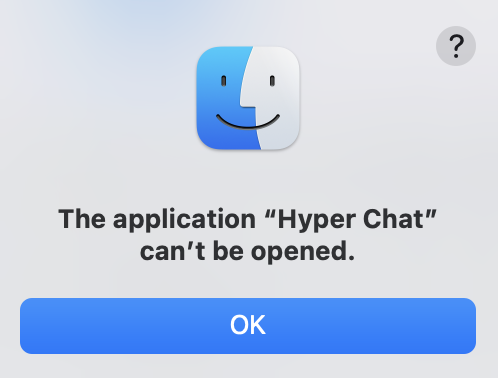

# Exodus

## Introduction

Exodus is a high-performance cross-platform AI chat application for desktop that is compatible with a variety of model providers.

## Model Providers

> [!NOTE]
> Exodus updates its model provider list once the model providers are updated. The following table lists the currently supported chat and reasoning models.

| Provider         | Chat Models                                                                 | Reasoning Models                        |
| ---------------- | --------------------------------------------------------------------------- | --------------------------------------- |
| OpenAI GPT       | gpt-4.1, gpt-4.1-mini, gpt-4.1-nano, gpt-4o, gpt-4o-mini, chatgpt-4o-latest | o4-mini, o3-mini, o3, o1, o1-pro        |
| Azure OpenAI     | gpt-4.1, gpt-4.1-mini, gpt-4.1-nano, gpt-4o, gpt-4o-mini, chatgpt-4o-latest | o4-mini, o3-mini, o3, o1, o1-pro        |
| Google Gemini    | gemini-2.5-flash-preview-05-20                                              | gemini-2.5-pro-preview-05-06            |
| Xai Grok         | grok-3-beta, grok-3-fast-beta                                               | grok-3-mini-beta, grok-3-mini-fast-beta |
| Anthropic Claude | claude-3-5-haiku-latest, claude-3-5-sonnet-latest                           | claude-3-7-sonnet-latest                |
| Ollama           | BASE ON YOUR OWN Ollama SERVICE                                             | BASE ON YOUR OWN Ollama SERVICE         |

## Core Features

### Daily Chat

Exodus offers a seamless chat experience, allowing users to engage in natural conversations with the AI. The chat interface is designed to be intuitive and user-friendly, making it easy for users to ask questions and receive informative responses.

### Deep Research

This system begins by analyzing the user’s query and research parameters (breadth and depth), generating follow-up questions to refine the research intent. It then conducts a deep research process by issuing multiple search queries, extracting key insights, and identifying new research directions. If deeper exploration is required, it recursively continues based on previous findings, maintaining context throughout. Finally, it compiles all results into a structured, source-cited markdown report that presents the information clearly and comprehensively.

### Built-in Calling Tools

#### Web Search

Exodus supports built-in Web Search using [Serper](https://serper.dev/) to retrieve Google Search results. To utilize the feature, you must first register for a Serper API Key and fill in the key in the settings.

#### Weather

Exodus supports built-in Weather Search using [Serper](https://serper.dev/) to retrieve weather information. To utilize the feature, you must first register for a Serper API Key and fill in the key in the settings.

#### Google Maps Routing

Exodus supports built-in Google Maps Routing using [Serper](https://serper.dev/) to retrieve directions and location information. To utilize the feature, you must first register for a Serper API Key and fill in the key in the settings.

#### Google Maps Place

Exodus supports built-in Google Maps Place using [Serper](https://serper.dev/) to retrieve place information. To utilize the feature, you must first register for a Serper API Key and fill in the key in the settings.

#### Image Generation

The Image Generation service only supports OpenAI. Please make sure you have configured the OpenAI API settings correctly before using these features.

### Audio and Speech

The Text-to-Speech and Speech-to-Text services only support OpenAI. Please make sure you have configured the OpenAI API settings correctly before using these features.

### MCP

- **Cross-Platform**: Exodus is built using Tauri, ensuring a consistent experience across macOS, Windows, and Linux.

## Experimental Features

xxx

## Under-Construction Features

xxx

## To start using Exodus

You can download Exodus on our [HomePage](https://exodus.yancey.app), or manual download on [GitHub Release](https://github.com/HyperChatBot/exodus/releases/).

We always keep the dev tools(eg: Command + Option + I) open in the production environment. In Exodus, everything is transparent and controllable.

### MacOS

As Exodus is not planning to be released on the App Store, you may encounter the following issue when you open it for the first time. Please follow the steps below to resolve it:

1. Move the `Exodus.app` to the `/Applications` directory.
2. Open your terminal App, execute the command `chmod +x /Applications/Exodus.app/Contents/MacOS/Exodus`.

## To start developing Exodus

### Prerequisites

We have chosen [Electron](https://www.electronjs.org/) as our cross-platform base. Make sure that [Node.js](https://nodejs.org/) and [pnpm](https://pnpm.io/) are installed on your system.

### Available Scripts

- To start the development window, you can execute `pnpm run dev`
- To build the bundle to MacOS, you can execute `pnpm run build:mac`
- To build the bundle to Linux, you can execute `pnpm run build:linux`
- To build the bundle to Windows, you can execute `pnpm run build:win`

## Contributing

The main purpose of this repository is to continue to evolve Exodus, making it faster and easier to use. Development of Exodus happens in the open on GitHub, and we are grateful to the community for contributing bugfixes and improvements. Read below to learn how you can take part in improving Exodus.

### [Code of Conduct](./CODE_OF_CONDUCT.md)

Exodus has adopted a Code of Conduct that we expect project participants to adhere to. Please read [the full text](./CODE_OF_CONDUCT.md) so that you can understand what actions will and will not be tolerated.

### [Contributing Guide](./CONTRIBUTING.md)

Read our [contributing guide](./CONTRIBUTING.md) to learn about our development process, how to propose bugfixes and improvements, and how to build and test your changes to Exodus.

### Good Issues

Please make sure to read the [Issue Reporting Checklist](./.github/ISSUE_TEMPLATE/bug_report.md) before opening an issue. Issues not conforming to the guidelines may be closed immediately.

## Discussions

If you have any questions or feedback about Exodus, please visit our [official discussion forum](https://github.com/orgs/HyperChatBot/discussions/71) to start a conversation with our team or other users. We are committed to making Exodus the best possible chat application, and your feedback plays a crucial role in achieving this goal.

## Acknowledgements

- The Deep Research is adapted from Dzhng's [deep-research](https://github.com/dzhng/deep-research).
- The fundamental Chat SDK is based on the public template from Vercel's [ai-chatbot](https://github.com/vercel/ai-chatbot).

## License

Exodus is licensed under the terms of the [MIT licensed](https://opensource.org/licenses/MIT).

