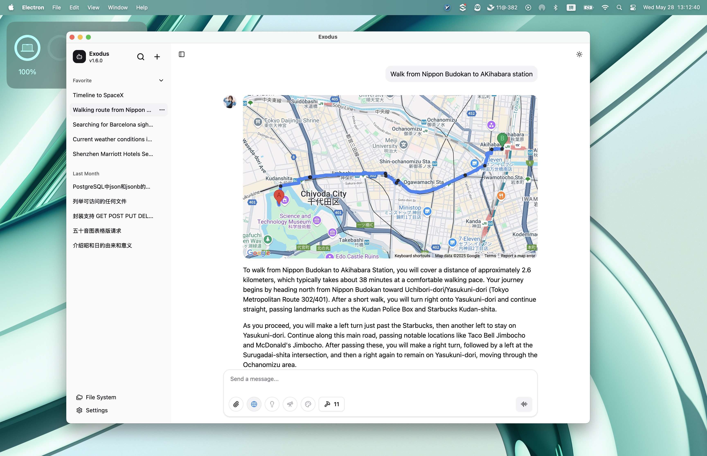
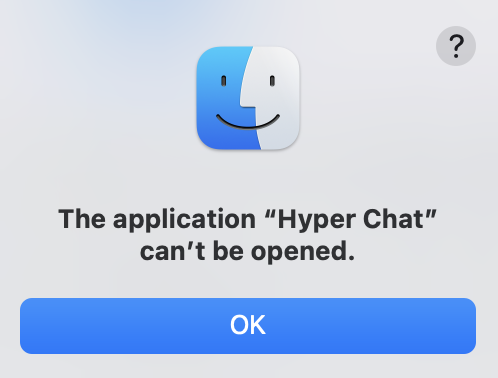

# Exodus

## Introduction

Exodus is a high-performance, cross-platform AI chat application for desktop that is compatible with a variety of model providers. It runs a full local backend — an embedded Postgres database (PGlite + pgvector), a Hono HTTP server, and a durable job queue — so features like retrieval, memory consolidation, and multi-agent runs happen on your machine.

## LLM Providers

> [!NOTE]
> Exodus tracks provider model lists as they change; the table below reflects the current defaults. Any provider's model list can also be extended in settings.

| Provider         | Chat Models                                                                   | Reasoning Models                   |
| ---------------- | ----------------------------------------------------------------------------- | ---------------------------------- |
| OpenAI GPT       | gpt-5.5, gpt-5.5-pro, gpt-5.4, gpt-5.4-pro/mini/nano                          | gpt-5.5-pro, gpt-5.5, gpt-5.4-pro  |
| Azure OpenAI     | gpt-5.5, gpt-5.5-pro, gpt-5.4, gpt-5.4-pro/mini/nano                          | gpt-5.5-pro, gpt-5.5, gpt-5.4-pro  |
| Google Gemini    | gemini-3.1-pro, gemini-3-flash, gemini-3.1-flash-lite, gemini-2.5-flash/-lite | gemini-3.1-pro, gemini-2.5-pro     |
| xAI Grok         | grok-4.3, grok-4.1-fast, grok-4, grok-code-fast-1                             | grok-4.3, grok-4                   |
| Anthropic Claude | claude-opus-4-8, claude-opus-4-7, claude-sonnet-4-6, claude-haiku-4-5         | claude-opus-4-8, claude-sonnet-4-6 |
| Ollama           | Based on your own Ollama service                                              | Based on your own Ollama service   |

## Core Features

### Daily Chat

A natural, multi-turn chat experience across every supported provider, with multi-step tool use, streaming responses, and Artifacts (a live side panel for generated code, documents, and web pages).

### Deep Research

Analyzes your query and research parameters (breadth and depth), generates follow-up questions to refine intent, then runs a recursive search process — issuing multiple queries, extracting insights, and identifying new directions while keeping context. It compiles everything into a structured, source-cited Markdown report.

### Knowledge Base (RAG)

An optional retrieval layer backed by a self-hosted [LightRAG](https://github.com/HKUDS/LightRAG) server (Exodus is a client only — see `docs/lightrag-setup.md`). Documents you add in settings are indexed into LightRAG; retrieval is context-only, and Exodus's own model writes the answer.

### Philharmonic — multi-agent Groups

Teams of agents that collaborate on a task. Each Group runs in an isolated workspace, has per-agent memory and tools, and supports scheduled (recurring or one-off) runs managed from the dashboard.

### Memory & Personalization

A durable, topic-consolidated memory of you. After each turn a single model call reconciles the conversation against the existing memory index; pre-turn, relevant entries are selected and rendered into the system prompt.

### Computer Use (macOS)

The AI operates a single application window with a virtual mouse and keyboard — it sees a screenshot each step and acts like a person (move, click, drag, scroll, type, key chords). Window-scoped and gated by an allowlist of apps you choose; it opens an allowlisted app that isn't running, and you can stop it any time with `⌥⇧⎋`. Every session is fully traced. Requires macOS Screen Recording + Accessibility permissions.

### App Lock

A local PIN lock that gates the whole app and every API call. The encrypted secret uses scrypt + Electron `safeStorage`; unlock happens only on the lock screen, never over HTTP.

### Lossless Context Management

Compacts long conversations without losing information — the agent gets summaries it can expand or grep on demand, so nothing is silently dropped.

### Home Discover

An optional home-screen feed of topics drawn from your memory, refreshed from [Brave News](https://brave.com/search/api/). Off by default; renders nothing until you opt in.

### Built-in Calling Tools

| Tool                                                | Notes                                                                        |
| --------------------------------------------------- | ---------------------------------------------------------------------------- |
| Web Search / Weather / Google Maps routing & places | via [Serper](https://serper.dev/) — needs a Serper API key in settings       |
| Web Fetch                                           | fetch and read a URL as clean text                                           |
| Knowledge Base search                               | queries the LightRAG index (see above)                                       |
| File tools                                          | read / write / edit / grep / find / list-directory within a scoped workspace |
| Terminal                                            | run a shell command                                                          |
| Computer Use                                        | drive an allowlisted macOS app window (see above)                            |
| Image Generation                                    | OpenAI only                                                                  |
| Create Artifact                                     | render code / a document / a web page into the side panel                    |

### Audio and Speech

Text-to-speech and speech-to-text (OpenAI only). Configure the OpenAI API settings before using these.

### MCP

Model Context Protocol servers can be configured in settings to expose external tools to the agent (automatic startup connection is currently archived).

### Cross-Platform

Built on Electron for a consistent experience across macOS, Windows, and Linux. Computer Use is macOS-only.

## Getting Started with Exodus

You can download Exodus from our [homepage](https://exodus.yancey.app) or manually from [GitHub Releases](https://github.com/HyperChatBot/exodus/releases/).

We always keep the developer tools (e.g., <kbd>Command</kbd> + <kbd>Option</kbd> + <kbd>I</kbd>) open in the production environment. In Exodus, everything is transparent and controllable.

### macOS

Since Exodus is not available on the App Store, you may encounter the following issue when you open it for the first time. Please follow the steps below to resolve it:

1. Move `Exodus.app` to the `/Applications` directory.
2. Open your terminal app and execute the command `chmod +x /Applications/Exodus.app/Contents/MacOS/Exodus`.

## Developing Exodus

### Prerequisites

We have chosen [Electron](https://www.electronjs.org/) as our cross-platform framework. Make sure that [Node.js](https://nodejs.org/) and [pnpm](https://pnpm.io/) are installed on your system.

### Available Scripts

| Command              | Description                                        |
| -------------------- | -------------------------------------------------- |
| `pnpm dev`           | Start development server with hot reload           |
| `pnpm build:mac`     | Build for macOS (also builds the Swift helper)     |
| `pnpm build:linux`   | Build for Linux                                    |
| `pnpm build:win`     | Build for Windows                                  |
| `pnpm build:helper`  | Build the `exodus-input` helper for Computer Use   |
| `pnpm test`          | Run unit tests (Vitest)                            |
| `pnpm test:watch`    | Run tests in watch mode                            |
| `pnpm test:coverage` | Run tests with coverage report                     |
| `pnpm typecheck`     | Run TypeScript type checking                       |
| `pnpm lint`          | Run oxlint (fast Rust-based linter)                |
| `pnpm lint:fix`      | Run oxlint with auto-fix                           |
| `pnpm format`        | Format code with oxfmt (fast Rust-based formatter) |
| `pnpm format:check`  | Check formatting without modifying files           |

## Contributing

The main purpose of this repository is to continue to evolve Exodus, making it faster and easier to use. The development of Exodus happens in the open on GitHub, and we are grateful to the community for contributing bug fixes and improvements. Read below to learn how you can take part in improving Exodus.

### [Code of Conduct](./CODE_OF_CONDUCT.md)

Exodus has adopted a Code of Conduct that we expect project participants to adhere to. Please read the [full text](./CODE_OF_CONDUCT.md) so that you can understand what actions will and will not be tolerated.

### [Contributing Guide](./CONTRIBUTING.md)

Read our [contributing guide](./CONTRIBUTING.md) to learn about our development process, how to propose bug fixes and improvements, and how to build and test your changes to Exodus.

### Good Issues

Please make sure to read the [Issue Reporting Checklist](./.github/ISSUE_TEMPLATE/bug_report.md) before opening an issue. Issues not conforming to the guidelines may be closed immediately.

## Discussions

If you have any questions or feedback about Exodus, please visit our [official discussion forum](https://github.com/orgs/HyperChatBot/discussions/71) to start a conversation with our team or other users. We are committed to making Exodus the best possible chat application, and your feedback plays a crucial role in achieving this goal.

## Acknowledgements

- The deep research feature is adapted from Dzhng's [deep-research](https://github.com/dzhng/deep-research).
- The fundamental chat SDK is based on the public template from Vercel's [ai-chatbot](https://github.com/vercel/ai-chatbot).

## License

Exodus is licensed under the terms of the [MIT License](https://opensource.org/licenses/MIT).

